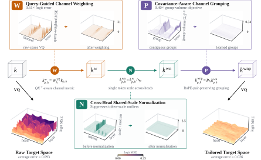

<div align="center">

# TaSQ

### Tailoring the Quantization Space for 1-Bit KV Cache Compression

[Overview](#overview) · [Quick Start](#quick-start) · [Benchmarks and Methods](#benchmarks-and-methods) · [Repository Layout](#repository-layout)

</div>

<p align="center">
  
</p>

## Overview

TaSQ (**Ta**ilored **S**pace Vector **Q**uantization) is an LLM KV cache vector quantization (VQ) method that tailors the VQ target space for ultra-low-bit compression.
TaSQ applies three transformations to pre-RoPE keys:

- **Query-guided channel weighting** emphasizes key channels according to their effect on attention
  logits.
- **Cross-head shared-scale normalization** suppresses token-scale outliers with low metadata cost.
- **Covariance-aware channel grouping** places dependent channels in the same local codebook while
  preserving RoPE pairs.

Together, these transformations make the quantization space better aligned with error sensitivity and the statistical structure of key activations, substantially improving VQ quality in the 1-bit regime.
Notably, weighting and grouping permutation can be easily merged into projection weights and codebooks, so TaSQ adds negligible overhead over standard VQ.

The repository includes codebook construction pipelines and SGLang-based implementations of
TaSQ and three KV cache VQ baselines: [CQ](https://arxiv.org/abs/2405.03917), [NSNQuant](https://arxiv.org/abs/2505.18231), and [NovaKV](https://arxiv.org/abs/2608.04074).
We also provide scripts for evaluating general capabilities, reasoning, long-context retrieval,
and serving efficiency.

## Quick Start

### Setup

The setup script creates two Python 3.10 Conda environments: `tasq-serve` for calibration and
serving, and `tasq-eval` for the evaluation client.

```bash
git clone https://github.com/mscheong01/TaSQ.git
cd TaSQ
./setup_envs.sh
```

### Reproducing an Experiment

The following example commands build all supported methods for Qwen3-4B, validate the artifacts, evaluate each method on GSM8K, and generate the corresponding table.

```bash
# 1. Build TaSQ and baseline artifacts.
./experiments/build/build_artifacts.sh Qwen/Qwen3-4B

# 2. Check model dimensions, codebook shapes, and transform layouts.
./experiments/build/verify_artifacts.sh Qwen/Qwen3-4B

# 3. Run GSM8K benchmark. Completed runs are skipped automatically.
./experiments/non_reasoning_bench/scripts/qwen3_4b__gsm8k.sh

# 4. Aggregate results into a table.
cd experiments/non_reasoning_bench
python3 make_table.py
```

To build or evaluate only selected methods, pass the method ID explicitly (`cq`, `nova1b`, `nsn`, or `tasq`):

```bash
./experiments/build/build_artifacts.sh Qwen/Qwen3-4B tasq
./experiments/non_reasoning_bench/scripts/qwen3_4b__gsm8k.sh tasq
```

Artifact generation includes codebook fitting using the calibration dataset.
All experiment settings
can be overridden through the variables documented in [`config.sh`](config.sh).

### Serving with SGLang

The provided benchmark scripts automatically launch and manage the SGLang server, so no separate
server setup is required for running the experiments above.

To launch a standalone SGLang server, run:

```bash
conda activate tasq-serve
PREFILL_BACKEND=triton \
  ./scripts/serve_method.sh \
  Qwen/Qwen3-4B \
  vq \
  artifacts/qwen3_4b_tasq_g8 \
  --port 30000 \
  --context-length 32768
```

You can change `PREFILL_BACKEND` depending on your GPU architecture.

## Benchmarks and Methods

### Benchmarks
| Evaluation | Directory | Description |
|---|---|---|
| General | [`experiments/non_reasoning_bench`](experiments/non_reasoning_bench) | GSM8K, MATH500, MBPP, HumanEval, BBH, and MMLU |
| Reasoning | [`experiments/reasoning_bench`](experiments/reasoning_bench) | AIME 2024/2025, LiveCodeBench v6, and SciBench |
| Long-context retrieval | [`experiments/ruler_niah`](experiments/ruler_niah) | RULER needle-in-a-haystack retrieval from 4k to 64k context |
| Serving efficiency | [`experiments/efficiency_analysis`](experiments/efficiency_analysis) | Throughput, prefill latency, KV cache capacity, and generation length |

### Methods and Effective Bitwidths

| ID | K / V bits per channel | Description |
|---|---:|---|
| `bf16` | 16 / 16 | BF16 KV cache reference |
| `cq` | 1.250 / 1.250 | CQ-8c10b |
| `nova1b` | 1.375 / 1.250 | NovaKV adapted to the 1-bit regime |
| `nsn` | 1.238 / 1.238 | NSNQuant-1b |
| **`tasq`** | 1.266 / 1.250 | **TaSQ** (Ours); 1.263 / 1.250 for Phi-4 |


## Repository Layout

```text
TaSQ/
├── assets/                    codebooks and figures
├── calibration/               calibration and statistics collection
├── codebooks/                 codebook generation for TaSQ and baselines
├── experiments/               benchmark and efficiency experiments
├── python/                    SGLang fork and Triton KV kernels
├── scripts/                   scripts for serving and evaluation
├── tasks/                     benchmark task definitions
├── third_party/kvquant/       calibration and k-means code adapted from KVQuant
├── config.sh                  experiment configuration
└── setup_envs.sh              environment setup
```

## License
This repository is released under the [Apache License 2.0](LICENSE).
Third-party components and redistributed assets retain their original terms; see
[NOTICE](NOTICE) for attribution and source details.
